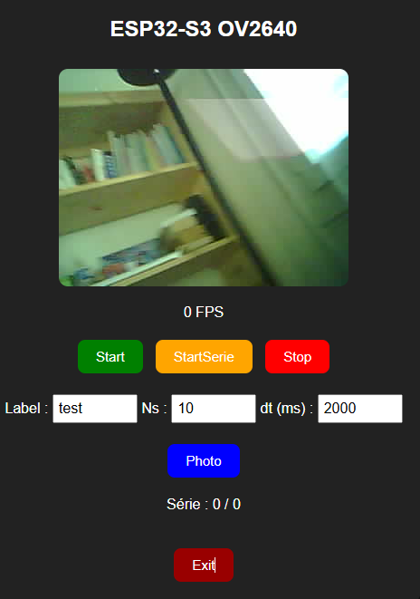
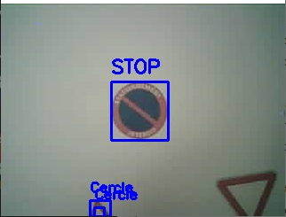

# Méthode pour ajouter un nouveau panneau routier 

Choisir un panneau et imprimez-le. Identifier un label associé à l'objet, qui doit être un nouveau label ajouté à la liste des labels déjà entraînés.

## Création des images du dataset

Utiliser le "ESP32-S3 Cam" en utilisant `Thonny` en exécutant le pogramme `Python\InitDataset.py`

Ce programme lance un serveur Web `ESP32-CAM` et affiche une page WEB qui propose plusieurs fonctionnalités:
- se connecter sur sur le serveur et afficher la page `192.168.4.1` sur un navigateur
- tester la caméra sur la photo du panneau (options `Start` ou `Photo`)
- lorsque les réglages semblent satisfaisants, 
  - on choisir `Ns=50` vues au moins
  - on choisit le label
  - lancer une série de captures sur la photo choisie, en faisant varier l'orientation, la distance, l'angle de la caméra en s'assurant que l'objet reste visible dans la caméra

Les images sont au départ, générées dans l'espace privé de Thonny. Et les images n'apparaissent 
pas tant que le programme tourne. Il est donc important de quitter le programme puis raffraichir 
l'affichage de l'espace privé de Thonny.

Ensuite, on va transférer toutes les images dans le dossier du PC `dataset/images`

Cette action a généré 50 photos (par label) sous le nom `dataset\images\photo_<label>_<numéro>.jpg`

On doit aussi s'assurer que le set d'images on été déposées dans un dossier `dataset/images/photo*.jpg` (qui contenait déjà les autres photos du dataset complet)

## Ensuite nous allons créer les descriptifs associés à chaque image. 

Pour cela on exécute le programme `Python\detourage.py`

Pour chaque image, on va ajuster la `BoundingBox` englobante entourant l'objet (clavier "s" pour sauvegarder les fichiers de description) sous le nome
`dataset/xml/photo_<label>_<numéro>.xml`

On a ainsi augmenté le dataset de l'ensemble des photos pour ce nouvel objet.

On termine la préparation du dataset en créant un ZIP à partir de dossier `dataset`

## L'étape suivante consiste à générer le modèle avec l'application WEB MaixHub:

- créer un projet P (de type detection)
- créer un dataset P associé
- remplir le dataset à partir du zip créé précédemment (`dataset.zip`) charger dans le projet
- créer une tâche d'apprentissage
- télécharger le résultat sous forme d'un zip contenant le modèle kmodel 
   et un programme main à charger dans le K210

# Bien sûr la dernière étape va consister à télécharger le modèle 
kmodel que l'on installe grâce à l'application `kflash_gui`

Le modèle s'installe à l'adresse `0x300000`
