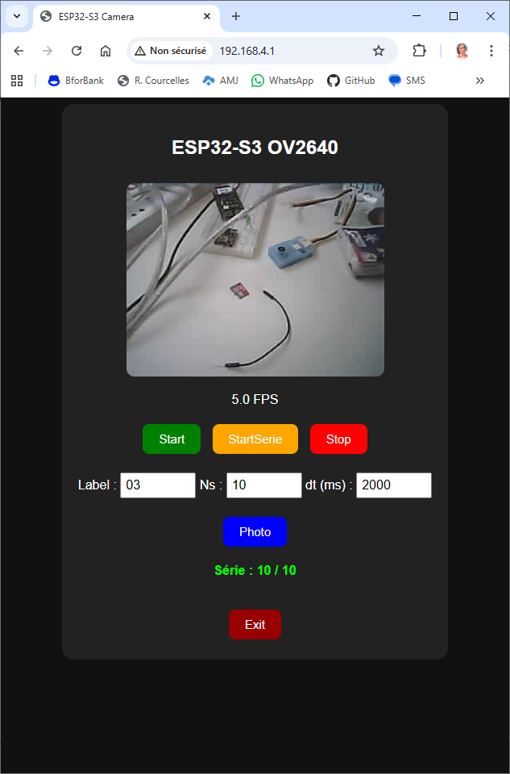
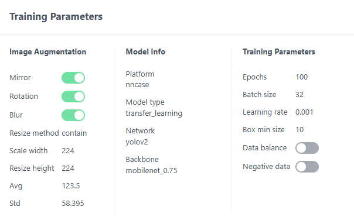
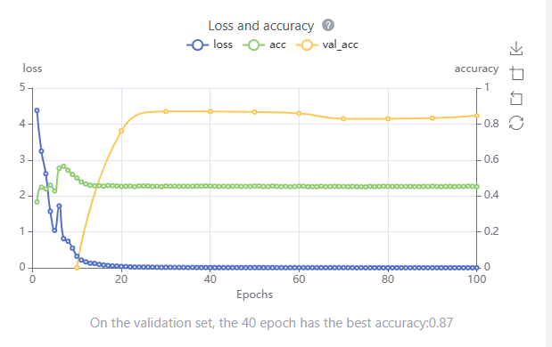
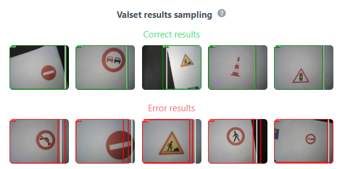

# ESP32S3Cam
Développement ESP32-S3 Cam

    python \install\esptool\esptool.py -p COM8 write_flash -z 0 esp32s3_camera_st7789_n8r8_1.20.bin

    D:\workspace\ESP32S3Cam\Freenove_ESP32_S3_WROOM_Board-main\Python\Python_Firmware>esptool -p COM8 write_flash -z 0 ESP32_GENERIC_S3-SPIRAM_OCT-20250809-v1.26.0.bin

    D:\workspace\ESP32S3Cam\Freenove_ESP32_WROVER_Board-main\Python\Python_Firmware>python \install\esptool\esptool.py -p COM8 write_flash -z 0 ESP32_GENERIC-SPIRAM-20250809-v1.26.0.bin

    D:\workspace\ESP32S3Cam\Freenove_Ultimate_Starter_Kit_for_ESP32_S3-main\Python\Python_Firmware>python \install\esptool\esptool.py -p COM8 write_flash -z 0 ESP32_GENERIC_S3-SPIRAM_OCT-20250809-v1.26.0.bin

# Application pour créer les images automatiquement

    Dataset.py

]

- on sélectionne un label
- un nombre d'images
- on lance l'option "StartSerie" et on déplace la caméra sur l'objet à identifier

Les images sont créées sous le nom "dataset/images/photo_<label>_<numéro>.jpg"

Ensuite on utilise l'application "create_dataset.py" (basée sur OpenCV) qui va détecter les bounding box et créer les descriptions XML pour chacune des images dans le directry dataset/XML/photo_<label>_<numero>.xml

Ensuite on download le zip qui contient la structure du dataset dans MaixHub

On effectur l'entrainement

